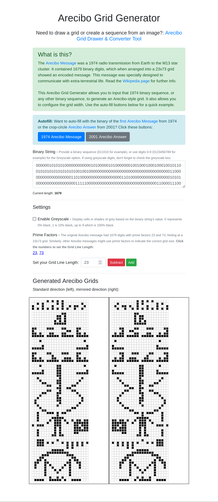

# Arecibo Grid Tools

Welcome to the GitHub repository for the **Arecibo Grid Tools**. Inspired by the iconic [Arecibo Message](https://en.wikipedia.org/wiki/Arecibo_message) of 1974, which was specially designed to communicate with extra-terrestrial life, this repository hosts some web tools designed for those interested in exploring and recreating Arecibo grids or binary sequences. This repository contains two main tools:

1. **Arecibo Grid Generator Tool**
2. **Arecibo Grid Drawer Tool**

## Arecibo Generator Tool

The **Arecibo Grid Generator** allows users to input binary sequences and generate Arecibo-style grids. It also has options for greyscale inputs, autofill for the 1974 Arecibo Message or the 2001 Arecibo Answer, and customizable grid settings.

## Arecibo Drawer Tool

The **Arecibo Grid Drawer** lets users create binary strings based on grid designs. Users can load Arecibo grid images as templates, adjust grid dimensions, and generate custom binary sequences.

## Usage

You can access and use these tools directly on Github Pages:

- [**Arecibo Grid Generator Tool**](https://nullbio.github.io/aricebo-tools/generator)
- [**Arecibo Grid Drawer Tool**](https://nullbio.github.io/aricebo-tools/drawer)

## Contributing

Contributions are welcome. If you'd like to suggest improvements or bug fixes:

1. Fork the repository.
2. Create your feature branch.
3. Commit your changes.
4. Push to the branch.
5. Open a new pull request.

## License

This project is licensed under the MIT License. See `LICENSE` file for more details.

## Contact

If you're in communication with E.T. and would like to share your secrets, contact me via email at pat[at]null[dot]bio. If you find this project helpful, consider giving it a star! 

## Screenshot of Generator

